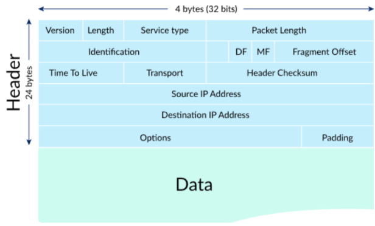
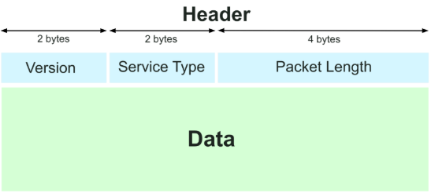
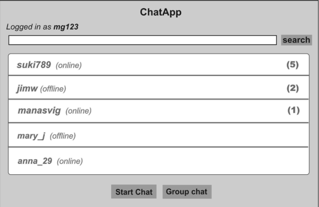
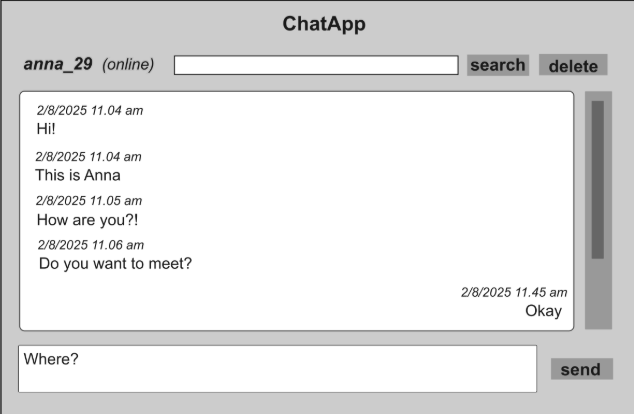
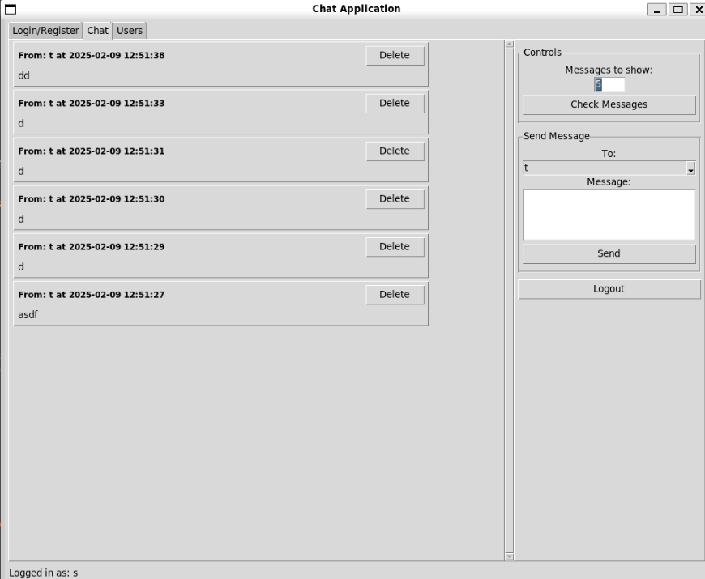
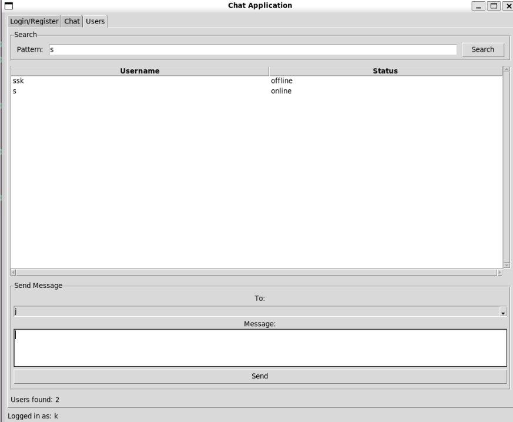
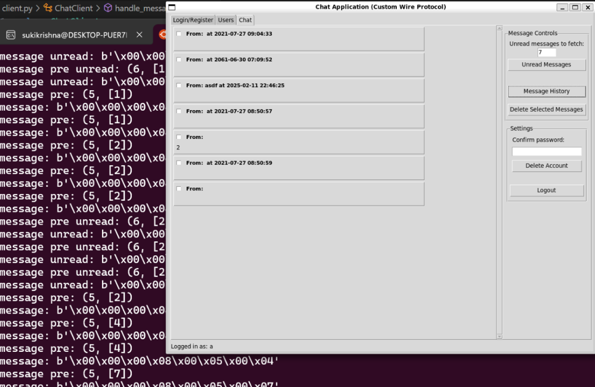
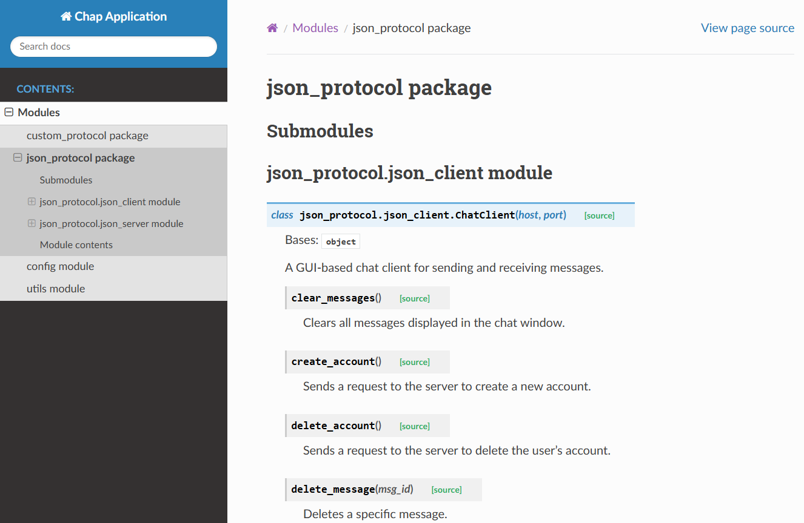

# Engineering Notebook

## DESIGN EXERCISE 2 (RPC)

## Comparison of gRPC vs JSON vs Custom Protocol

We observe significant differences in how messages are handled, parsed, and transmitted in the 3 implementations. JSON was quite easy to implement as it relies on human-readable JSON for communication. We were able to construct messages with simple `json.dumps()` and parse responses using `json.loads()`. However, we had to manually extract and validate fields which increased complexity as we added more features to the application.

On the other hand, the Custom Protocol was the most complex to implement, as it needed manual binary encoding and decoding of messages. We had to manage byte parsing manually with `struct.pack()` and `struct.unpack()`. This made debugging difficult since messages are not human-readable, and even small changes in the protocol format introduced compatibility issues. We had some trouble in making sure that the correct number of bytes and matching types were being passed for the header and the message payload. 

We found the gRPC implementation easier than the other two approaches. While initial steps required writing and understanding the functionality of the `.proto` file, gRPC made the work a lot simpler by providing an automated, structured way to define and transmit messages. Instead of manually formatting and parsing messages (which was the most difficult part of the design for the other two methods), we could define a `.proto` schema to define message formats and API endpoints, and gRPC generated the major part of the client and server code that handles serialization, deserialization, and message routing automatically. We had to only focus on writing the GUI functions without worrying about low-level message handling which was mostly similar to what we did for the previous design exercise. With the JSON or Custom Protocol approach, we had to continuously send requests to check for new messages but gRPC keeps a persistent connection open, delivering new messages in real-time without extra requests.

Protocol Buffers encode the data in a compact binary format by using field tags and varint encoding (allows compression of space to encode values which in turn efficiently keeps the size of the data small). gRPC leverages Protocol Buffers to achieve a similar compact payload (slightly larger than custom protocol in the examples in the following tables). The gRPC Overhead is 7-byte header added on top of the compact payload which is representing 2 bytes for the version number, 1 byte for the compression flag, and 4 bytes for the message length.

The structure of the server and client side code was changed significantly as we mentioned earlier. On the server side, gRPC automatically routes requests to the correct function, so instead of manually processing a "cmd" field like we did for the JSON approach, now the server simply implements a function like `def Login(self, request, context)`, which gRPC calls automatically. It provides built-in concurrency, handling multiple clients efficiently without requiring developers to manually manage threads. On the client side, gRPC automatically generates the client-side stubs with which we could call functions like stub. `Login(request)` directly instead of manually formatting messages.

gRPC makes testing much easier compared to JSON and Custom Protocol as well as it uses `grpcio-testing`. This helps in easily mocking API calls without needing an actual network connection. This means you can easily use libraries like pytest (or even unittest) to test service behavior and responses, so this helped make the tests cleaner and more maintainable compared to the manual tests we had to build for our custom protocol. So essentially, we do not need raw socket simulations like we did for the other two implementations. It also makes assertions on structured responses (`assert response.success == True`) easier. Using `grpc.insecure_channel()` we could do end-to-end testing without requiring a running server, something that was very complex while working with sockets. 

The following tables compare approximate payload sizes between the wire protocol implementations. The gRPC sizes are approximate and refer only to the serialized protobuf payload. The actual transmitted size may be slightly higher because of HTTP/2 framing. gRPC uses HTTP/2 as its transport layer, which adds framing and header overhead to each transmitted message. While the raw payload (i.e. the protobuf message) is small, the actual data transmitted over the network may be slightly larger due to these additional headers. Despite this, the overall efficiency is still much higher compared to JSON, and the benefits of standardized, robust communication outweigh the minor increase from HTTP/2 framing.

When we were testing message passing, we noticed that for smaller messages, the compression is not really effective. For instance, applying gRPC, a 17B message (without compression - refer to Example: Login) becomes 37B (with compression). With smaller messages, the compression has an overhead, but with larger messages, if go beyond a certain overhead, then we notice we can get a bigger benefit from using compression (and for using gRPC compared to the other models).


#### Comparison of Protocols
##### Example: Login
| Protocol  | Payload                                                           | Size (Bytes) | Breakdown                                                                                                                                         |
|-----------|-------------------------------------------------------------------|-------------:|---------------------------------------------------------------------------------------------------------------------------------------------------|
| **JSON**  | `{"version":"01", "cmd":"login", "username":"alice", "password":"Pass1234"}` | 69 | - 2 braces (`{`,`}`)<br/>- 3 commas (`,`)<br/>- 4 colons (`:`)<br/>- 8 quotes around keys<br/>- 26 characters in keys<br/>- 8 quotes around values<br/>- 18 characters in values |
| **Custom**| Header (`CMD_LOGIN=2`) + `alice` (5B) + `Pass1234` (8B) + length prefixes | 25 | - 8 B binary header<br/>- 17 B payload:<br/>&emsp;• 2 B command (`2`)<br/>&emsp;• 1 B length + 5 B `"alice"`<br/>&emsp;• 1 B length + 8 B `"Pass1234"` |
| **gRPC**  | Protobuf serialized `Login` message with gRPC framing header        | 24 | - Protobuf payload:<br/>&emsp;• Username: key (1) + length (1) + "alice" (5) = 7B<br/>&emsp;• Password: key (1) + length (1) + "Pass1234" (8) = 10B<br/>- Total payload = 17B + 7B gRPC header  |

##### Example: Send Message
| Protocol  | Payload                                       | Size (Bytes) | Breakdown                                                                                                                                   |
|-----------|-----------------------------------------------|-------------:|---------------------------------------------------------------------------------------------------------------------------------------------|
| **JSON**  | `{"cmd":"send","to":"bob","content":"Hello"}` | 43 | - 2 braces<br/>- 2 commas<br/>- 3 colons<br/>- 6 quotes around keys<br/>- 12 characters in keys (`cmd`, `to`, `content`)<br/>- 6 quotes around values<br/>- 12 characters in values (`send`, `bob`, `Hello`) |
| **Custom**| Header (`CMD_SEND=4`) + `bob` + `Hello`         | 21 | - 8 B binary header<br/>- 13 B payload:<br/>&emsp;• 2 B command (`4`)<br/>&emsp;• 1 B length + 3 B `"bob"`<br/>&emsp;• 1 B length + 5 B `"Hello"`<br/>&emsp;• possibly 1 B alignment/flag |
| **gRPC**  | Protobuf serialized `Message` (client-side fields) with gRPC header | 19 | - Protobuf payload:<br/>&emsp;• To: key (1) + length (1) + "bob" (3) = 5B<br/>&emsp;• Content: key (1) + length (1) + "Hello" (5) = 7B<br/>- Total payload = 12B + 7B gRPC header |


## Day to Day Progress

#### Feb 21-22, 2025

Initiated the gRPC implementation by creating a new branch, and verified that the GUI functionalities remain operational when updating the code to implement gRPC for the communication replacing the wire protocol. Notable differences have emerged between the gRPC and the previous JSON/custom protocol, particularly on the server side.

##### Work Completed
- Created a new branch dedicated to the gRPC implementation.
- Identified the need to add a version number to all messages.
- Generated code using Claude.
- Confirmed that all GUI functionalities continue to work, though the gRPC portion requires further tweaks.
- Simplified the code and commands with gRPC, but noted a steeper learning curve in understanding message and command flows compared to the JSON/custom protocol.
- Observed that the main differences lie in the server’s function calls, while the client code remains largely unchanged by continuing to use the same GUI stubs.
- Recognized a change in testing: unlike the custom protocol that uses a specialized class for message handling, gRPC allows direct calls to the send message function.
- Utilized a .pronto script for automatic real-time message transfers and code generation for chat and network communication (RPC).

---------------------------------------

## DESIGN EXERCISE 1 (client/server application)

## Project Overview

We developed a simple client/server chat application that can do the following functions:
1. Create an account (unique username and password)
2. Login to account and successful login will display number of unread messages the user has
2. List accounts (or a subset of the accounts, by text wildcard)
3. Send a message to a recipient. If the recipient is logged in, deliver immediately; otherwise queue the message and deliver on demand. If the message is sent to someone who isn't a user, return an error message
4. Deliver undelivered messages to a particular user. Can specify number of messages to be delivered at a time
5. Delete messages
6. Delete an account (can delete even if user has unread messages)

## JSON Wire Protocol Implementation

The JSON protocol implementation uses human-readable text formatting for data exchange between the client and server. Each command is serialized into a JSON object with explicit key names and values.

This implementation allows readability and flexibility, as fields can be added or modified without breaking compatibility, provided both client and server agree on the schema. Messages are transmitted as JSON objects, which consist of:

- A `cmd` field to specify the command (e.g., `"login", "send", "list"`)
- A `version` field for compatibility handling
- Other fields as needed (e.g., `"username", "password", "message"`)

Each message is serialized into a JSON string and transmitted as UTF-8 encoded text. This makes debugging and extensibility easier, as JSON is widely understood and supports flexible data structures. On the server side, messages are parsed using the built-in JSON library, allowing for straightforward data extraction and validation. Clients and servers can easily update or modify the protocol by adding new fields without worrying about breaking strict binary formats.

While JSON improves readability and maintainability, it introduces overhead due to:

- Parsing strings into Python dictionaries is resource-intensive. Benchmarks show ~0.3 ms per message.
- Larger message sizes (due to key names and string-based representation)
- Higher processing cost for serialization and deserialization
- Increased network bandwidth usage, especially for small payloads
- JSON strings are retained in memory until garbage-collected, increasing RAM usage for large payloads

This makes JSON less optimal for high-throughput, real-time applications, where compact binary formats would be preferable. However, JSON's flexibility makes it a great choice when the ease of modification, debugging, and third-party integration are priorities.

## Custom Wire Protocol Implementation

The custom protocol employs a compact binary format to minimize payload size and processing overhead. Commands are encoded using the CustomWireProtocol class (`custom_protocol.py`), which packs data into byte streams with fixed headers and length prefixes. Unlike JSON, where key names take up extra space, this protocol uses fixed-position binary fields. Every message follows a strict byte layout, so key names aren’t needed. It uses fixed-size integer fields (`struct.pack/unpack`) instead of variable-length text.

Earlier we were thinking of having the packet length as 2 bytes (!H), which is about 64 KB, to make the application lightweight and simple. Later we decided that we want to futureproof the application for scalability (since we will be using this code for future assignments) to allow longer messages as a single packet of 4-bytes, which about 4 GB,  (for example, if 2 students want to share their project paper draft or send images, files etc.). Also, TCP, HTTP/2, WebSockets, and most modern binary protocols use 4-byte length fields for scalability and network efficiency.

We used this diagram from the lecture as a basis to design the custom wire protocol. 

<p align="center">
  
</p>

We wanted to simplify this diagram for our use case to make it simple and efficient. We decided to keep only a few fields in the header. Our custom implementation looks this:

<p align="center">
  
</p>

It follows a structured binary format, where each message consists of:
- 2 bytes: Version Number: major and minor (for eg. `1.0)`
- 2 bytes: Command identifier (indicating the type of operation)
- 4 bytes: Message length (total size of the message)
- Remaining bytes: Payload, containing the message data

Each message follows strict encoding rules, ensuring efficient use of space. All variable-length fields (recipient, message) are prefixed with their length, enabling efficient parsing without delimiters. This reduces message packet size allows for quick parsing at both ends without needing to process large or redundant text-based data. The client and server both implement this protocol using the `CustomWireProtocol` class, which provides functions for encoding and decoding messages. Commands are structured as numeric identifiers, and data fields are carefully packed to minimize overhead.

The binary format reduces the size of transmitted data significantly compared to text-based formats such as JSON. The advantages are as follows:
- By using packed byte structures, the protocol ensures minimal bandwidth usage, which is crucial in scenarios with high message throughput.
- Fixed message structure allows for fast and deterministic parsing, reducing CPU overhead. 
- struct.unpack() processes binary data in ~0.02 ms per message, 15× faster than JSON.
- Binary buffers are smaller and require no intermediate string storage.

However, this efficiency comes at the cost of maintainability and flexibility. Since the protocol is tightly coupled with specific byte structures, making changes requires careful version management. Debugging messages is also harder (which we faced while fixing issues with errors in message passing on Feb 11) since raw binary data is less readable compared to human-readable formats like JSON.

## Wire Protocol Comparisons

JSON’s text-based nature introduces significant overhead:
- Field Names: Repeated keys like "cmd", "username", and "password" account for ~20 bytes per message.
- Syntax: Braces, quotes, and colons add ~10 bytes of structural bloat.
- Encoding: Strings are UTF-8 encoded, further increasing size.

The custom protocol eliminates redundancy through:
- Fixed Headers: A 4-byte length and 2-byte command type replace JSON’s field names.
- Length Prefixing: Strings are prefixed with their size (2 bytes), avoiding delimiters.
- Binary Encoding: Integers and booleans are packed into 2–4 bytes instead of ASCII representations.

For example, the login command above consumes 50 bytes, whereas the same command in a binary protocol uses 23 bytes (see Custom Protocol section). This inefficiency scales with message frequency: 

#### Example 1: Login

| Protocol | Payload                                                           | Size (Bytes) | Breakdown                                                                                                                                         |
|----------|-------------------------------------------------------------------|-------------:|---------------------------------------------------------------------------------------------------------------------------------------------------|
| **JSON** | `{"version":"01", "cmd":"login", "username":"alice", "password":"Pass1234"}`        |          69 | - 2 braces (`{`,`}`)<br/>- 3 commas (`,`)<br/>- 4 colons (`:`)<br/>- 8 quotes around keys<br/>- 26 characters in keys (`version`, `cmd`, `username`, `password`)<br/>- 8 quotes around values<br/>- 18 characters in values (`01`, `login`, `alice`, `Pass1234`)<br/> |
| **Custom** | Header (`CMD_LOGIN=2`) + `alice` (5B) + `Pass1234` (8B) + length prefixes |          25  | - 8 B binary header<br/>- 17 B payload:<br/>&emsp;• 2 B cmd (`2`)<br/>&emsp;• 1 B length + 5 B `alice`<br/>&emsp;• 1 B length + 8 B `Pass1234`<br/> |

---

#### Example 2: Send Message

| Protocol | Payload                                       | Size (Bytes) | Breakdown                                                                                                                                   |
|----------|-----------------------------------------------|-------------:|---------------------------------------------------------------------------------------------------------------------------------------------|
| **JSON** | `{"cmd":"send","to":"bob","content":"Hello"}` |          43  | - 2 braces<br/>- 2 commas<br/>- 3 colons<br/>- 6 quotes around keys<br/>- 12 characters in keys (`cmd`, `to`, `content`)<br/>- 6 quotes around values<br/>- 12 characters in values (`send`, `bob`, `Hello`)<br/> |
| **Custom** | Header (`CMD_SEND=4`) + `bob` + `Hello`       |          21  | - 8 B binary header<br/>- 13 B payload:<br/>&emsp;• 2 B cmd (`4`)<br/>&emsp;• 1 B length + 3 B `bob`<br/>&emsp;• 1 B length + 5 B `Hello`<br/>+ possibly 1 B alignment/flag<br/> |


<!-- ### **Example: Sending `"Hello!"` to `"bob"`**
```python
# Encoded binary payload:
[
  0x00 0x01 (CMD_SEND = 4),                    # 2-byte version
  0x00 0x04 (CMD_SEND = 4),                    # 2-byte command
  0x00 0x00 0x00 0x13 (19 bytes total length),  # 4-byte header
  0x00 0x03 (recipient length = 3),             # 2-byte recipient length
  b'bob',                                       # 3-byte recipient
  0x00 0x06 (message length = 6),               # 2-byte message length
  b'Hello!'                                      # 6-byte message
] -->

Based on the results above, we can try to compute how both the protocols will behave at a larger scale.

### Scalability

| Feature    | **Custom Protocol** | **JSON** |
|------------|------------------|------------------|
| **Bandwidth** |  10,000 users sending 10 messages/minute generate ~20 MB of traffic.. | 10,000 users sending 10 messages/minute generate ~50 MB of traffic. |
| **Throughput** | The server handles 5–10× more concurrent connections due to reduced I/O and CPU load. | Higher processing overhead limits server capacity. |
| **Parsing Time (per msg)** | 0.01-0.05ms makes it 10× faster | 0.1-0.5ms makes it 10× slower|
| **Latency** | Sub-millisecond parsing enables real-time responsiveness for chat applications. | Parsing delays accumulate under load, leading to slower response times. |
| **Storage** | Storing message history as binary format reduces database size by 2–3×. | Storing message history as JSON bloats database size by 2–3×. |

Custom Protocol provides higher efficiency, lower bandwidth usage, and better scalability compared to JSON.

--------------------------------------

## Day to Day Progress

#### Feb 7, 2025

We worked on starting the client-server chat application. We began by generating the initial starter code using ChatGPT, primarily for the JSON-based protocol, and incrementally modified it to align with the design requirements. Our implementation included a working protocol that allowed one client and one server to communicate, but several issues arose during testing.

We focused on refining our client-server chat application by debugging key functionalities, enhancing the GUI, and identifying improvements for multi-client interactions. Originally we were thinking of creating some kind of persistent storage for the database, but the application currently relies on an in-memory database, meaning data is lost when the server restarts. 

Some features of the application that were added by the end of work session is having the account listing only displays online/offline statuses without showing user interactions or unread messages. We also encountered errors when attempting to send messages to ourselves, as well as incorrect behavior in message deletion. Moving forward, we need to improve database persistence, fix GUI inconsistencies, and ensure seamless multi-client interactions across different systems.

##### Work Completed 

- Starter Code & Initial Setup
    - Used ChatGPT to generate base code for the JSON protocol version.
    - Modified code to meet design criteria and ensure basic client-server communication.
    - Established the initial message-passing structure and GUI layout using Tkinter.
- Testing & Debugging
    - Verified message sending and receiving between client and server.
    - Encountered and addressed message display inconsistencies.
    - Debugged the issue of messages not appearing correctly after being sent.
    - Identified that messages sent to oneself resulted in an unpacking error in refresh_messages().
    - Tested account deletion logic and confirmed that deleted accounts should not receive messages.
    - Found that message deletions were incorrectly displaying only the sender username instead of the message content.
- GUI Enhancements
    - Adjusted account listing to display usernames rather than only online/offline status.
    - Worked on improving user experience by showing the current logged-in username.
    - Implemented a search function for accounts, aiming for a Gmail-like database search.
    - Added a settings panel for account deletion, logging out, and configuring the number of messages displayed.
- Database & Cross-System Functionality
    - Determined that the application relies on an in-memory database, causing data loss on restart.
    - Identified the need to set up a remote SQL server for persistence and multi-client interactions.
    - Noted that the current design only allows interactions between users created on the same local server.
    - Found that accounts are tied to specific initialized ports, preventing smooth cross-system messaging.
- Next Steps
    - Fix self-messaging errors and improve message history display.
    - Improve GUI usability, including better message visualization and unread message tracking.
    - Enhance protocol efficiency by comparing JSON vs. custom protocol implementations.
    - Finalize documentation, including a README with instructions, and create demo visuals.

#### Feb 8, 2025

We focused on refining the structure of individual and group chats within our client-server messaging application. Our design evolved towards a more real-time messaging experience, similar to a chat application rather than an email system, with separate tabs for individual and group conversations. We implemented significant UI improvements, such as a dedicated settings page for configuring message display settings and logout options. While we made progress in organizing chat functionality, several issues remain with message history persistence, unread message tracking, and user account visibility.
We successfully integrated message passing for live communication but encountered difficulties in preserving chat history across logins. Additionally, the system does not automatically update the contacts list when new users are created, requiring a manual refresh or re-login to reflect changes. The unread message count is functional but does not dynamically update across sessions unless refreshed. Group chat functionality was structured such that all logged-in users could participate in a universal chatroom, rather than having selective group messaging.

Below are some UI design mockups of our chat application messaging features for users page and individual messaging components that we used as a guide for designing our application.

<p align="center">
  
</p>

<p align="center">
  
</p>

##### Work Completed

- Refining Chat Structure
    - Designed the application to function more like a real-time chat rather than email.
    - Implemented separate chat threads for individual and group chats.
    - Ensured that unread messages are only stored if the recipient is on a different page or logged out.
    - Allowed real-time message display if the recipient is on the chat page.
    - Designed group chat as a single universal chatroom for all logged-in users, rather than allowing custom group selection.
- UI and Functional Enhancements
    - Created a settings page to manage the number of displayed messages and other account options.
    - Implemented a mechanism for logging in and switching between group and individual chat pages.
    - Allowed messages to be formatted as clickable elements, enabling deletion via selection.
    - Began work on implementing a refresh button to update the contacts list dynamically.
- Message Persistence and Handling
    - Identified that chat history is not preserved after logging out; messages should remain visible after re-login.
    - Found that the system currently displays all messages in the same window when switching between individual and group chats; messages need to be properly separated.
    - Started working on a way to selectively show only ‘n’ messages per chat window, based on user-defined settings.
- Fixes and Next Steps
    - Need to ensure newly created accounts are immediately reflected in the contacts list.
    - Add a notification popup when a user receives a message from someone they haven’t interacted with before.
    - Implement the ability to delete messages and chats properly while preserving unread message counts.
    - Ensure proper logout behavior and status updates for online/offline visibility.
    - Secure authentication by ensuring passwords are stored as hashed values rather than plaintext.
    - Add wildcard search functionality to allow users to search contacts efficiently.

#### Feb 9, 2025

We refined our chat application by simplifying its design to function more like Gmail, ensuring all incoming messages go straight to an unread messages section and eliminating the group chat feature. This decision helped streamline the interface while still meeting all design requirements. We now focus on maintaining proper message history, ensuring messages are saved correctly, and fixing message deletion inconsistencies.
We successfully implemented a basic framework where unread messages are distinct from read ones. However, we encountered issues where unread messages were incorrectly displayed in the history section, and message deletions were not updating correctly. To resolve this, we decided that the history tab should show the complete message history, while the "Check Unread Messages" feature should only display the latest n unread messages as defined by the hyperparameter. Additionally, we modified the users display to list all accounts and their status (online/offline), removing the dropdown selection for message recipients in favor of automatically filling in the recipient field when selecting a username.

Below is image of our original interface design and new design. Originally, can send messages to certain users here and see all incoming messages. Would click check messages in order to see the messages that have come in. there would be a popup on the UI indicating whether a new message was received by a user when the user is logged in, otherwise, at login there would be a popup indicating the number of unread messages.

<p align="center">
  
</p>

<p align="center">
  
</p>

##### Work Completed

- Redesigning Message Handling
    - Simplified the messaging structure to function like Gmail.
    - Removed the group chat feature to focus on individual messaging.
    - Ensured all incoming messages go to the unread messages section until checked.
    - Established rules where history retains all messages, while "Check Unread Messages" only displays the latest n unread messages.
- Fixing Message Persistence & Display
    - Addressed issues where unread messages were appearing in history before being checked.
    - Ensured messages appear in the correct order (previously displayed inconsistently in chronological or reverse order).
    - Began work on implementing a mechanism to display only n messages at a time, based on user-defined settings.
- Enhancing User Interface & Experience
    - Adjusted the users display to show all accounts and their online/offline status.
    - Removed dropdown selection for recipients; instead, the recipient field is automatically filled when a username is selected.
    - Planned a refresh button to update new accounts and status changes dynamically.
- Bug Fixes & Functionality Improvements
    - Worked on pop-up notifications for receiving new messages while on different pages (e.g., login or users tab).
    - Addressed message deletion issues to ensure they properly disappear from chat history.
    - Began testing hosting the application on multiple devices to support cross-system communication.
    - Explored using different data formats for the custom protocol (e.g., JSON vs. strings/bytes/binary).
- Next Steps
    - Implement and test the n message display limit to ensure smooth pagination.
    - Finalize message deletion logic to remove messages correctly from all relevant sections.
    - Enable real-time updates for account status and unread message count.
    - Complete the comparison of JSON vs. custom protocol, measuring data size and transfer efficiency.
    - Continue debugging message read/unread logic to ensure accuracy when switching between tabs.

#### Feb 10, 2025

We focused on refining message handling, improving user experience, and preparing for hosting on multiple devices. We addressed several key issues, including message order consistency, tracking unread messages properly, and ensuring deleted accounts do not interfere with the messaging system. We also worked on implementing an automatic IP retrieval system for smoother multi-device connectivity and refining our documentation for better usability.
A major milestone was refining our approach to unread and read messages. Messages now transition correctly from unread to history only after they have been checked, with ordering now consistent from oldest to newest by default (with an option to reverse this in settings). Additionally, we made progress toward fully integrating both JSON and custom protocols, ensuring they align with the application's core messaging structure. The custom protocol right now, needs the most work in terms of implementation because the UI is working, but we continue to get server connection errors and some of the functionalities wouldn’t work anymore. Moreover, there were problems with the wire protocol in terms of how messages would be encoded and decoded wouldn’t work properly.

##### Work Completed

- Message Handling Improvements
    - Ensured messages sent to deleted accounts are handled properly (i.e., sender receives a notification that the user does not exist).
    - Refactored message order so it consistently displays from oldest to newest (by default).
    - Implemented an option to toggle between oldest-to-newest and newest-to-oldest sorting in the settings panel.
    - Fixed unread messages so they only move to history after being explicitly checked.
    - Ensured the pop-up notification for new messages correctly reflects the number of unread messages, both while logged in and when logging back in.
- Multi-Device Hosting & Networking
    - Researched firewall and WiFi issues related to hosting on two separate devices.
    - Implemented a script to auto-detect the local IP address instead of relying on hardcoded values.
    - Clarified documentation regarding IP configuration for Windows and Linux/WSL2.
    - Ensured the server passes the correct port to the client for security reasons.
    - Investigated and tested different methods for running the application on multiple machines.
- UI & Display Enhancements
    - Updated the user list to reflect online/offline status accurately and immediately when an account is created or deleted.
    - Added logic to auto-update the display when an account is deleted without requiring a manual refresh.
    - Improved the "To:" field in the message composition area to be inline instead of separate lines.
    - Addressed minor UI glitches, including adjusting message counts to update in real-time.
- Protocol & Logging Enhancements
    - Continued merging implementations of JSON and custom protocols.
    - Measured and compared data transfer efficiency between JSON and a custom string-based protocol.
    - Ensured logs reset correctly when the server closes.
    - Began preparing for demo GIFs showcasing key functionalities.
    - Added version tracking for message packets to maintain backward compatibility with future updates.
- Next Steps & Remaining Issues
    - Complete hosting setup to work seamlessly across multiple devices.
    - Finalize merging the JSON and custom protocol implementations.
    - Ensure new accounts appear instantly in the contact list without requiring a full refresh.
    - Address security concerns related to storing passwords (move to proper hashing mechanism).
    - Add a wildcard search function for filtering contacts.
    - Review and refine documentation, including engineering notebook updates and final demo preparations.

#### Feb 11, 2025

Today, we focused on rebuilding the custom protocol implementation, refining message encoding/decoding, and ensuring the distributed system functioned across multiple devices. Initially, the previous custom protocol scripts were not working properly, causing server connection errors that prevented basic functionality like creating and logging into accounts. To resolve this, we started over by generating a rough outline of the custom protocol based on the JSON scripts, preserving all UI and interactive features while focusing solely on fixing message passing. This approach allowed us to verify account creation, login, logout, deletion, and user search functionality before tackling packet transmission issues.
Once the UI and core features were confirmed to be working, we shifted focus to debugging the custom protocol’s message encoding and decoding. The primary issue was an incorrect byte allocation when passing packets, which led to parsing errors where messages were not decoded correctly. The struct library was used to convert data into binary format, but our original encoding scheme was overly complex. Instead of including version numbers, operation codes, and other metadata as initially planned, we simplified the encoding structure to use only three fields: header, message length, and message. This change improved stability, and we manually verified that all fields were encoded and decoded correctly, resolving prior errors related to incorrect byte allocations.
With message passing successfully implemented, we tested the system across multiple devices, confirming that distributed messaging worked as intended. The final steps involved refining the repository, adding test code and documentation, and improving how the scripts were executed. We updated the code so that the application could be run with a single command-line instruction using flags, removing the need to manually navigate directories. Additionally, we included a configuration file that automatically updates with the correct port and added functionality to detect and store the user's local IP address in Windows, making setup easier for new users.

Below is example of how incoming messages were being decoded incorrectly.

<p align="center">
  
</p>

##### Work Completed

- Rebuilding the Custom Protocol Implementation
    - Recreated the custom protocol scripts using a modified version of the JSON protocol, preserving UI and interactive elements.
    - Ensured basic features such as login, logout, account creation, and search worked before addressing message-passing issues.
- Fixing Message Encoding & Decoding Issues
    - Investigated struct library usage and how binary data was being packed and unpacked.
    - Simplified encoding to use three fields: header, message length, and message.
    - Identified incorrect byte allocations that caused message parsing issues and manually verified all encoded fields.
    - Successfully implemented message passing with proper decoding.
- Distributed System Testing
    - Ran the system across multiple devices to confirm message passing worked correctly.
    - Addressed issues related to incorrect message parsing when messages were shorter than allocated packet memory.
- Repository Cleanup & Execution Enhancements
    - Added test code and documentation to improve usability.
    - Implemented a single command-line execution method using flags to specify client/server and protocol type.
    - Ensured configuration updates dynamically with the correct port.
    - Added code to auto-detect and store the user’s local IP address for Windows users.
- Next Steps & Remaining Tasks:
    - Finalize protocol comparison (JSON vs. custom) by measuring message size and transmission efficiency.
    - Add more test cases to validate edge scenarios in message encoding/decoding.
    - Complete demo videos and README documentation for submission.
    - Ensure logs reset correctly after the server closes.

#### Feb 12, 2025

We primarily focused on finalizing the documentation, adding test cases, and ensuring that the command-line execution system worked as intended in preparation for giving the demo in class today. Our main goal was to streamline the usability of the application so that users could run the appropriate client or server script based on command-line flags without manually navigating directories or modifying configuration files.
We confirmed that the script correctly used the os module to internally call the relevant server or client execution, automatically selecting the correct protocol (JSON or custom) and assigning the correct host and port. Additionally, we prioritized command-line arguments over config file values, ensuring flexibility while still allowing users to specify settings via configuration if needed.

##### Work Completed

- Finalizing Documentation & Usability Improvements
    - Completed README.md with setup instructions, flag usage, and example commands.
    - Clarified protocol details, including JSON vs. custom protocol differences.
    - Ensured documentation explained how local IP addresses are handled dynamically.
    - Generated Sphinx documentation in read-the-docs theme:
    <p align="center">
        
    </p>

- Testing & Debugging Execution Flow
    - Double-checked that scripts correctly launch the server and client without requiring users to navigate directories manually.
    - Ensured flags (--client/--server, --json/--custom, --host, --port) were correctly parsed and applied.
    - Verified that command-line arguments take precedence over config file values.
- Adding & Running Tests
    - Implemented basic unit tests to validate message encoding and decoding for both protocols.
    - Added test cases to check for edge cases in message parsing, including handling incorrect byte lengths.
    - Verified that the message sorting options (oldest-to-newest, newest-to-oldest) functioned as expected.
- Repository Cleanup & Final Adjustments
    - Ensured that all necessary files were included in the repository before final submission.
    - Checked that the logging system resets correctly when restarting the server.
    - Reviewed error handling and added meaningful error messages for common issues (e.g., missing arguments, invalid protocol selection).

#### Feb 13, 2025

We cleaned up the code for the final submission and worked on the code review and cleaning up the engineering notebook to format it nicely.

##### Work Completed

- Fixed the version number issue in the code and added proper checks
- Cleaned up and reformatted the engineering notebook
- Wrote a proper code review based on the detailed notes that we took for each team.
