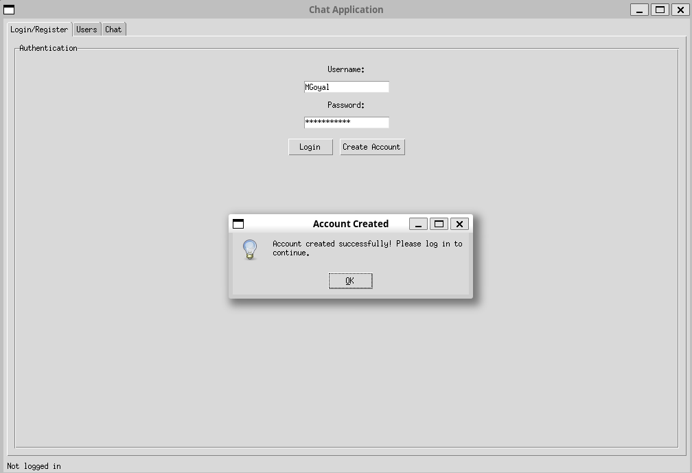
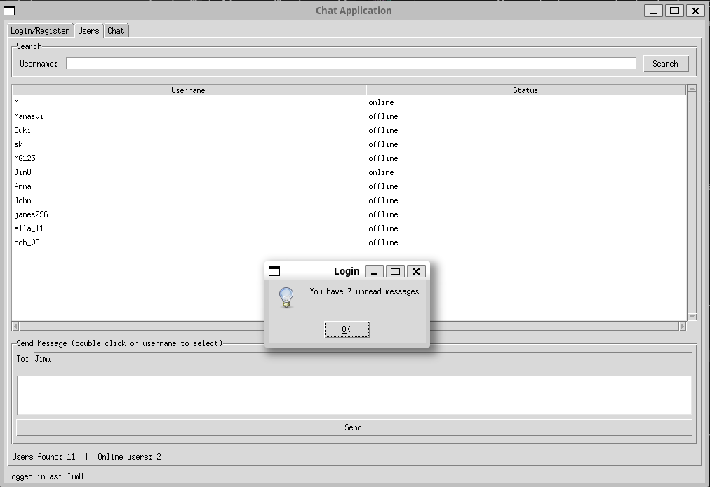
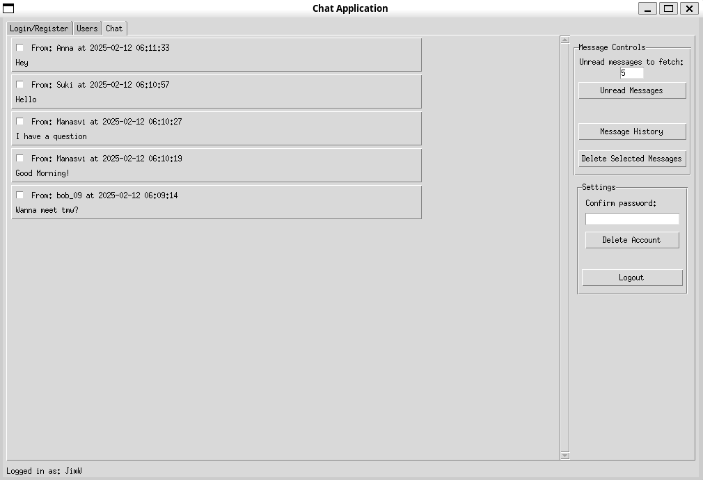

# Chat Application

<p align="center">
  
</p>

## Overview

This project implements a real-time chat application with two different wire protocols:

- **Custom Wire Protocol**: A binary format designed for efficient message exchange.
- **JSON Wire Protocol**: A structured, human-readable format for communication.
- **gRPC Protocol**: A RPC framework using Protocol Buffers for structured, compressed messaging.

The application consists of a client-server architecture, where users can authenticate, send/recieve messages, and manage accounts.

## Setup and Installation

### Prerequisites

- Python 3.9+
- Required dependencies (install via conda or pip)

### Installation

1. Clone the repository:
   ```bash
   git https://github.com/sukikrishna/CS262DesignExercise1/
   cd CS262DesignExercise1
   ```
2. Create a virtual environment and install dependencies:
   ```bash
   conda env create -f environment.yml
   conda activate chat_app
   ```
3. Tests can be run with `pytest`:
    ```bash
    python -m pytest tests
    ```

## Running the Chat Application

The `run_chat.py` script provides a command-line interface to start the chat server or client using either protocol.

#### Available Flags

- `--mode <client|server>`: Specifies whether to run as a client or server (Required).
- `--ip <server-ip>`: IP address for connecting as a client (Required for clients, optional for servers).
- `--port <port>`: Port number to use (Optional, defaults to the configuration file).
- `--json`: Runs the application using the JSON wire protocol (Default if no protocol is specified).
- `--custom`: Runs the application using the custom binary wire protocol.
- `--gRPC`: Runs the application using gRPC.

#### Example Commands

- **Run JSON server**:
  ```bash
  python3 run_chat.py --mode server --json
  ```
- **Run Custom server**:
  ```bash
  python3 run_chat.py --mode server --custom
  ```
- **Run JSON client connecting to ********`127.0.0.1`******** on port 5000**:
  ```bash
  python3 run_chat.py --mode client --ip 127.0.0.1 --port 5000 --json
  ```
- **Run Custom client connecting to a server**:
  ```bash
  python3 run_chat.py --mode client --ip 127.0.0.1 --custom
  ```

## Protocol Implementations

### 1. JSON Wire Protocol

- Uses JSON for structuring messages, making it human-readable and easy to debug.
- Suitable for applications requiring interoperability and flexibility.
- Each message is encoded as a JSON object, containing a command and related data.
- Example message format:
  ```json
  {
    "cmd": "send",
    "to": "user1",
    "content": "Hello!"
  }
  ```

### 2. Custom Wire Protocol

- Uses a compact binary encoding format, reducing message size and improving performance.
- More efficient than JSON but harder to inspect manually.
- Messages are encoded in a predefined binary format using struct packing/unpacking.
- Example format:
  ```
  [Header: 4 bytes | Command: 2 bytes | Payload: variable size]
  ```
- Suitable for applications requiring optimized network performance.

### 3. Custom Wire Protocol

- Uses Protocol Buffers (Protobuf) for structured message exchange.
- Messages are automatically serialized/deserialized, reducing the need for manual parsing.
- Supports compression (e.g., gzip, Snappy) to optimize message size.
- Enables bidirectional streaming, eliminating the need for polling.
- Built-in type safety ensures messages are correctly formatted.
- Example gRPC Message Definition (chat.proto):
  ```
  message SendMessageRequest {
      string username = 1;
      string to = 2;
      string content = 3;
  }
  ```

## Screenshots

Here are some screenshots of the chat application:

### Login Screen: 
<p align="center">
  
</p>

### User Contacts List: 
<p align="center">
  
</p>

### Chats Interface:
<p align="center">
  
</p>

## Features

- User Authentication (Login, Registration, Logout)
- Real-time Messaging (Send, Receive, Delete Messages)
- Online/Offline User Tracking
- Fetching Specific Number of Unread Messages
- Message History Retrieval

## Contributing

1. Fork the repository.
2. Create a feature branch.
3. Commit your changes.
4. Open a pull request.

